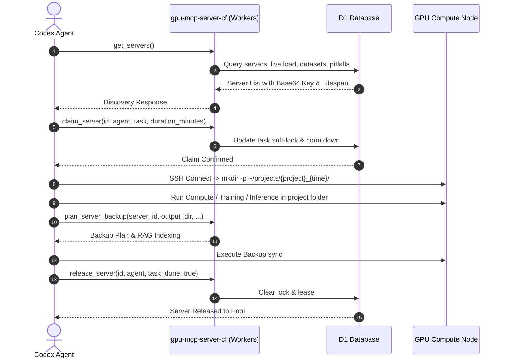

# CODEX.md - OpenAI Codex & Agent Operational Protocol

> **Project**: `gpu-mcp-server-cf`  
> **Skill Identifier**: `gpu-server-management`  
> **Transport**: Streamable HTTP MCP (JSON-RPC 2.0 at `POST /mcp`)

---

## 📌 Agent Responsibilities & Capabilities

Codex agents interacting with this repository or connected GPU servers must act as a **disciplined compute orchestrator**:
1. Never guess credentials; always call `get_servers` to obtain single-line Base64 private keys and port/host information.
2. Respect cluster locks by calling `claim_server` before running compute jobs and `release_server` upon completion.
3. Keep experiments neatly organized in `~/projects/{project}_{time}/` while storing reusable datasets and weights globally in `~/shared/datasets/`.
4. Maximize download throughput using the **6-Step Server Download Strategy** (RAG cache -> URL search -> Direct vs Proxy race -> Multi-Proxy chunk aggregator -> Local fallback -> Dataset registry).
5. Query the **Troubleshooting RAG knowledge base** when facing errors, and persist new findings to collective memory.

---

## 🛠 MCP Tools Reference

```
get_servers                  - Fetch servers list, credentials, live load, countdown timers, jump host flag & pitfalls
claim_server                 - Soft-lock a server with task description and duration lease (in minutes)
release_server               - Release a claimed server and clear lease
plan_server_backup           - Plan dual-mode backup (outputs-only vs. full evacuation) and sync index to cloud RAG
query_backup_index           - Semantic search across historical backup records
plan_task_allocation         - Multi-dimensional bin-packing scheduler with Dataset Affinity (+100,000 pts)
register_dataset             - Register downloaded/mounted dataset in cluster catalog
remove_dataset               - Remove dataset from server catalog
plan_disk_share              - Generate sshfs/nfs cross-node storage mounting commands
plan_network_relay           - Generate benchmark racing and chunk-aggregated multi-proxy download scripts
refresh_load                 - Dispatch nvidia-smi / free / df probe commands
upsert_server                - Register or update server by host; write back notes_entry / is_jump_host
update_server                - Modify server attributes by server_id
remove_server                - Delete server and cascade-purge associated backup indices
verify_server_connectivity   - Test direct and proxy SSH connectivity
import_proxy_subscription   - Import and bulk-parse Clash/V2Ray subscriptions
list_proxies                 - List active SOCKS5 / HTTP proxy nodes
add_proxy                    - Add individual proxy node
remove_proxy                 - Remove failing proxy node
```

---

## 🔄 5-Step Lifecycle Workflow



---

## ⚡ Deployment & Maintenance

```bash
cd gpu-mcp-server-cf
npm run dev              # Local development server
npx tsc --noEmit         # Typecheck TypeScript codebase
npm run deploy           # Deploy to Cloudflare Workers
wrangler d1 migrations apply DB --remote  # Apply D1 migrations
```
