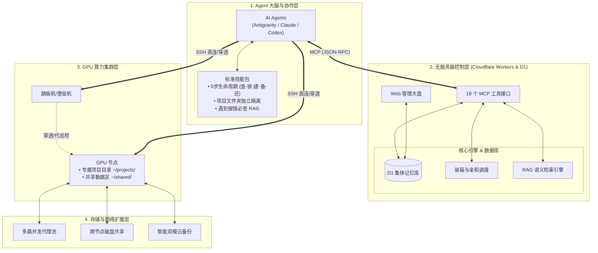

<div align="center">
  <h1>GPU Server Management MCP</h1>
  <p><strong>A Serverless GPU Cluster Orchestrator, Collective Memory & Troubleshooting RAG Protocol for AI Agents</strong></p>
  <p>专为 AI Agent (Antigravity, Claude Code, Codex, Cursor) 打造的轻量级无服务器分布式 GPU 算力集群调度与集体记忆系统</p>

  <p>
    
    
    
    
    
  </p>
</div>

---

<div align="center">
  <a href="#-中文说明">简体中文文档</a> | <a href="#-english">English Documentation</a>
</div>

---

# 中文说明

## 快速开始：一键全自动部署

本项目内置 **零人工配置全自动流水线**。只需运行以下命令，即可自动完成 Cloudflare 授权、D1 数据库创建、表结构迁移、代码构建与发布，并直接输出开箱即用的 MCP 客户端配置。

```bash
# Windows (PowerShell)
.\deploy.ps1

# Linux / macOS
chmod +x deploy.sh && ./deploy.sh

# Node.js (npm)
cd gpu-mcp-server-cf && npm run deploy:auto
```

---

## 核心特性与创新亮点

*   **One-Shot 极简连接 (`get_servers`)**
    一步返回可用服务器、Base64 密钥、实时负载、到期倒计时与踩坑经验。无惧 LLM 上下文截断，随时无损恢复连接凭据。
*   **算力与数据双向亲和 (Dataset Affinity)**
    基于已缓存数据集进行调度。调度器 (`plan_task_allocation`) 对拥有目标数据的节点自动附加 **+100,000 分权重**，彻底消灭重复下载。
*   **双重计时防死锁机制 (Dual Timers)**
    精准区分 **服务器物理剩余寿命** (`server_expires_at`) 与 **当前任务租期倒计时** (`duration_minutes`)，资源调度井然有序。
*   **全局排错知识库与集体记忆 (Troubleshooting RAG)**
    Agent 在任何机器上踩过的坑 (`pitfalls`)、环境配置笔记，全部汇入云端向量检索池。遇到报错先查库，实现集群智慧进化。
*   **内网跳板机与探针机制 (`is_jump_host`)**
    专设跳板机角色，轻松穿透内网、防火墙，安全代理分发状态探针，统一纳管私有算力。
*   **超大文件并发聚合下载 (Multi-Proxy Chunk Aggregator)**
    针对大模型/数据集(>500MB)，自动分片(64MB/Chunk) 并利用代理池与直连多通道并发拉取，榨干每一滴带宽。
*   **NVIDIA NIM 多模态视觉解析**
    内置 Web 控制台无缝集成 NVIDIA NIM API（密钥本地存储），一键截图 OCR 解析并自动录入服务器配置。

---

## Agent 标准生命周期 SOP

为保障集群健康协作，所有接入本系统的 Agent（如 Claude Code, Codex 等）均需严格遵守 **5步行为规范**：

1.  **查池与避坑 (`get_servers`)**：查看可用算力与 `pitfalls`（前人踩坑记录）。
2.  **声明锁定 (`claim_server`)**：登记 Agent 身份、任务描述与可选倒计时，防止算力被抢占踩踏。
3.  **项目隔离 (`mkdir -p ~/projects/{project}_{time}/`)**：所有代码、产出必须放于专属目录。公共环境全局安装，大模型/数据集放入全局 `~/shared/datasets/`。
4.  **智能备份 (`plan_server_backup`)**：物理租期充裕则仅备份输出产物；租期临近则执行全量撤离，并自动写入 RAG 索引。
5.  **主动释放 (`release_server`)**：任务完成或异常中止时，必须第一时间归还算力资源。

> **详细规范请参阅**：[CLAUDE.md](./CLAUDE.md) / [CODEX.md](./CODEX.md) / [AGENTS.md](./AGENTS.md)

---

## 18 个核心 MCP 工具集

<details>
<summary><b>点击查看完整工具列表与功能描述</b></summary>

| 模块 | 工具名称 | 核心能力 |
|---|---|---|
| **连接与发现** | `get_servers` | 获取集群节点全景信息、直连密钥、踩坑记忆 |
| | `claim_server` | 声明算力锁定与任务租期 |
| | `release_server` | 释放算力锁定状态 |
| **协同与备份** | `plan_server_backup` | 规划双模分流备份，同步云端 RAG 索引 |
| | `query_backup_index` | 语义化检索历史备份、配置与容灾快照 |
| | `plan_task_allocation` | 多维装箱调度与 Dataset Affinity 数据亲和性路由 |
| | `register_dataset` / `remove_dataset` | 管理全局数据集目录，支撑亲和性调度 |
| | `plan_disk_share` | 计算盘符共享（sshfs/nfs）指令挂载对端资源 |
| | `plan_network_relay` | 规划代理测速、动态竞速与大文件分片并发拉取指令 |
| | `refresh_load` | 触发节点负载与状态探针 |
| **注册与记忆** | `upsert_server` / `update_server` | 注册更新主机状态、写入运维笔记与跳板机标识 |
| | `remove_server` | 注销实例及级联清理历史索引 |
| **诊断与网络** | `verify_server_connectivity` | 测试直连与代理节点的可用性与延迟 |
| | `import_proxy_subscription` | 一键解析 Clash/V2Ray 订阅录入代理池 |
| | `list_proxies` / `add_proxy` / `remove_proxy` | 全生命周期代理节点维护 |
</details>

---

## 系统架构图

<details>
<summary><b>查看完整的四层架构设计</b></summary>


</details>

---

# English

## Quick Start: Zero-Config Deployment

Deploy the entire infrastructure to Cloudflare with a single command. The script handles authentication, database creation, schema migrations, and outputs ready-to-use client configurations for your AI agents.

```bash
# Windows (PowerShell)
.\deploy.ps1

# Linux / macOS
chmod +x deploy.sh && ./deploy.sh

# Node.js (npm)
cd gpu-mcp-server-cf && npm run deploy:auto
```

---

## Key Features

*   **One-Shot Discovery (`get_servers`)**
    Fetch credentials, live load, countdown timers, and "pitfalls" (historical caveats) in one API call. Immune to LLM context-window truncation.
*   **Dataset Affinity Routing**
    The scheduler (`plan_task_allocation`) applies a **+100,000 point boost** to nodes that already cache the required datasets, eliminating redundant multi-gigabyte downloads.
*   **Dual Countdown Timers**
    Tracks both **Server Physical Lifespan** (e.g., spot instance termination) and **Task Lease Duration** (preventing agent deadlocks).
*   **Collective Memory & Troubleshooting RAG**
    Errors encountered by one agent are logged as `pitfalls`. Future agents can semantically search the RAG database to instantly apply proven fixes.
*   **Bastion / Jump Host Tunnelling**
    Designate nodes as jump hosts (`is_jump_host`) to probe and route traffic into private, firewalled GPU networks.
*   **Multi-Proxy Chunk Aggregation**
    Massive datasets (>500MB) are automatically chunked into 64MB pieces and concurrently downloaded across multiple proxy nodes to saturate bandwidth.
*   **Multimodal OCR via NVIDIA NIM**
    The Web Dashboard integrates NVIDIA NIM (keys stored safely in local browser storage) to extract server specs from screenshots automatically.

---

## Agent Lifecycle SOP

All connected AI Agents must follow a strict **5-Step Workflow**:

1.  **Discover & Learn (`get_servers`)**: Check for available capacity and read `pitfalls`.
2.  **Claim (`claim_server`)**: Lock the node with a descriptive task and an optional lease timer.
3.  **Isolate (`mkdir -p ~/projects/{project}_{time}/`)**: Keep experimental outputs strict to the project folder. Install python dependencies globally. Store heavy weights in `~/shared/datasets/`.
4.  **Backup (`plan_server_backup`)**: Backup outputs (if lifespan is healthy) or evacuate fully (if dying). Synchronize backup metadata to the RAG index.
5.  **Release (`release_server`)**: Release the server immediately upon completion or failure.

> **For detailed guidelines, see**: [CLAUDE.md](./CLAUDE.md) / [CODEX.md](./CODEX.md) / [AGENTS.md](./AGENTS.md)

---

## Client Configurations

Once deployed, copy your worker URL (`https://<your-worker>.workers.dev/mcp`) into your agent's config file:

**Claude Code** (`~/.claude/settings.json`)
```json
{
  "mcpServers": {
    "gpu-mcp-server-cf": {
      "type": "http",
      "url": "https://<your-worker>.workers.dev/mcp"
    }
  }
}
```

**Antigravity / Gemini** (`~/.gemini/config/mcp_config.json`)
```json
{
  "mcpServers": {
    "gpu-mcp-server-cf": {
      "serverUrl": "https://<your-worker>.workers.dev/mcp"
    }
  }
}
```

---

<div align="center">
  <p>Built for the open source AI Agent community. Licensed under the <strong>MIT License</strong>.</p>
</div>
