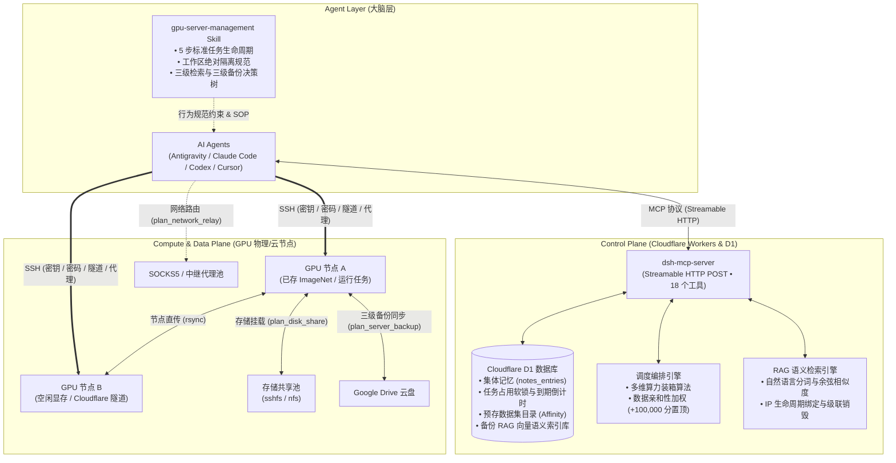
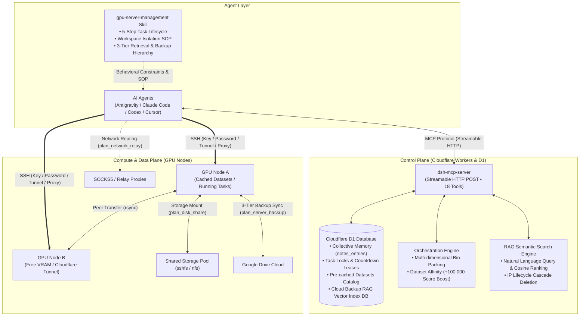

# GPU Server Management MCP & Skill

<p align="center">
  <b>专为 AI Agent (Antigravity, Claude Code, Codex, Cursor) 打造的轻量级无服务器分布式 GPU 算力集群调度与集体记忆系统</b><br>
  <sub>A Lightweight Serverless AI Cluster Orchestrator & Collective Memory Protocol for AI Agents</sub>
</p>

<p align="center">
  
  
  
  
  
  
</p>

---

## 📑 目录 / Table of Contents
- [🇨🇳 中文说明](#-中文说明)
  - [⚡ 一键全自动部署](#-一键全自动部署)
  - [系统定位与架构](#-系统定位与架构)
  - [核心特性与创新](#-核心特性与创新)
  - [18 个 MCP 工具总览](#-18-个-mcp-工具总览)
  - [Agent 标准生命周期 SOP 与隔离规范](#-agent-标准生命周期-sop-与隔离规范)
  - [三级智能备份与 RAG 向量检索](#-三级智能备份与-rag-向量检索)
  - [Web 管理控制台大盘](#-web-管理控制台大盘)
  - [客户端接入配置](#-客户端接入配置)
- [🌐 English](#-english)
  - [⚡ One-Click Automated Deployment](#-one-click-automated-deployment)
  - [System Architecture](#-system-architecture)
  - [Core Features & Innovations](#-core-features--innovations)
  - [18 MCP Tools Overview](#-18-mcp-tools-overview)
  - [Standard Agent Lifecycle & Workspace Isolation](#-standard-agent-lifecycle--workspace-isolation)
  - [3-Tier Backup & RAG Semantic Search](#-3-tier-backup--rag-semantic-search)
  - [Web Dashboard](#-web-dashboard)
  - [Client Setup](#-client-setup)

---

# 🇨🇳 中文说明

## ⚡ 一键全自动部署

本项目已内置**零人工配置的全自动一键部署流水线**。除了首次运行自动弹出浏览器登录 Cloudflare 授权外，其余所有步骤（创建 D1 数据库、回填配置、部署数据迁移、发布 Worker、生成客户端配置）**全自动一气呵成**！

### 运行一键部署命令：

```bash
# 方式 A：在 Windows 上运行
.\deploy.ps1

# 方式 B：在 Linux / macOS 上运行
chmod +x deploy.sh && ./deploy.sh

# 方式 C：通过 npm 运行
cd dsh-mcp-server-cf && npm run deploy:auto
```

> **自动化流程说明**：
> 1. 自动检测 Cloudflare 授权（未登录自动唤起浏览器授权）。
> 2. 自动创建 Cloudflare D1 数据库 `dsh-mcp-db` 并提取 ID。
> 3. 自动将 `database_id` 回填至 `wrangler.toml`，无需手动复制粘贴。
> 4. 自动应用数据库迁移（`migrations/0001` 至 `0013`）。
> 5. 自动编译并发布 Worker，终端最后直接打印出适配 Antigravity、Claude Code、Codex 的开箱即用配置代码块！

---

## 🏛 系统定位与架构

本系统是专为 **多 AI Agent 协同场景**（如 Antigravity、Claude Code、Codex 等）设计的分布式 GPU 算力集群中枢。通过将 Cloudflare Workers（无状态无服务器算力）与 D1 数据库结合，构建了一个具备**集体记忆、数据就近调度、软锁防冲突、三级分流备份与 RAG 向量检索**的轻量级 AI 算力管家。



---

## ✨ 核心特性与创新

1. **One-Shot 极简连接与抗压缩设计 (`get_servers`)**：
   - 一步返回包含 SSH 单行 Base64 私钥、端口、主机、实时负载、占用状态、到期倒计时及已存数据集的全部信息。
   - 对话上下文被 LLM 压缩后，仅需再次调用 `get_servers` 即可零记忆成本复活。
2. **算力与数据双向奔赴 (Dataset Affinity)**：
   - 支持通过 `register_dataset` 登记服务器已缓存的数据集与权重路径。
   - 装箱调度器 `plan_task_allocation` 针对具备目标数据的节点自动增加 **10 万分权重**，强制任务与数据就近绑定，彻底告别重复拉取大文件的等待。
3. **独立双计时机制：物理租期 vs. 任务倒计时 (Dual Countdown Timers)**：
   - **计时 1·服务器物理寿命 (`server_expires_at`)**：记录云服务器物理到期时间（例如按小时租用实例），Web 控制台显示 `🔋 物理剩余 3.5 小时` 或 `⚠️ 物理临期 45分 (即将关机)`；
   - **计时 2·任务执行倒计时 (`duration_minutes`)**：记录当前 Agent 跑实验的预计耗时，防止死锁与资源遗忘。
4. **智能双模备份决策树与云端 RAG 向量索引 (`plan_server_backup` / `query_backup_index`)**：
   - **【决策 A：物理剩余 > 1 小时 (充裕)】**：**仅备份本轮实验核心产出（权重/日志/配置）**，**坚决不备份庞大数据集**，数据集继续保留在节点供后续任务享受 Dataset Affinity 亲和调度；
   - **【决策 B：物理剩余 <= 1 小时 (临期关机/回收)】**：触发**全量资产疏散备份**（1. Google Drive 全量 -> 2. 对端服务器中转并登记数据集 -> 3. 本地核心私有权重备份），防止数据随机器关机而丢失；
   - **自动 RAG 建库与 IP 级联销毁**：所有备份自动在 MCP 建立 RAG 向量索引。**MCP 以源机 IP 为唯一生命周期计量**，源机一旦删除，对应 IP 的历史备份索引一同自动销毁。
5. **规划与执行分离 (Plan-not-Execute)**：
   - MCP 服务端仅负责最优解算与生成执行指令，Agent 负责在本地终端运行 SSH，兼顾 Serverless 的廉价高可用与 Agent 的自愈纠错能力。

---

## 🛠 18 个 MCP 工具总览

| 层次 | 工具名称 | 功能描述 |
|---|---|---|
| **第 1 层：连接与生命周期** | `get_servers` | 一步获取可用服务器、Base64 密钥、实时负载、预存数据集、占用状态与倒计时 |
| | `claim_server` | 任务开始前声明占用，标记当前 Agent、任务描述与可选倒计时分钟数 |
| | `release_server` | 任务结束后主动释放服务器占用，清空租期恢复空闲状态 |
| **第 2 层：多机协同与备份** | `plan_server_backup` | 三级智能分流备份规划，自动生成结构化索引并上传 MCP RAG 数据库 |
| | `query_backup_index` | 自然语言/指标关键词 RAG 语义检索历史备份记录（IP 生命周期绑定） |
| | `plan_task_allocation` | 多任务多维装箱调度算法（支持数据集亲和性加权 +100,000 分） |
| | `register_dataset` | 登记服务器已下载/挂载的数据集名称、绝对路径与大小 |
| | `remove_dataset` | 移除已删除或卸载的数据集元数据记录 |
| | `plan_disk_share` | 硬盘不足时计算并输出 `sshfs`/`nfs` 挂载对端机器的命令包 |
| | `plan_network_relay` | 网络受阻时生成代理加速或跳板机中转下载命令 |
| | `refresh_load` | 下发实时负载探测指令包（`nvidia-smi`, `free`, `df`） |
| **第 3 层：注册与集体记忆** | `upsert_server` | 以 host 为唯一键注册/更新服务器；写回运维知识（`notes_entry`） |
| | `update_server` | 按 ID 修改服务器字段或上下架状态 |
| | `remove_server` | 永久移除指定服务器（同时自动级联清理该 IP 下的所有备份索引） |
| **第 4 层：诊断与代理池** | `verify_server_connectivity` | 测试直连 SSH 与代理可达性并缓存延迟 |
| | `list_proxies` | 查看当前配置的 SOCKS5 / HTTP 代理池 |
| | `add_proxy` | 向中继代理池添加新代理节点 |
| | `remove_proxy` | 从代理池中移除失效代理 |

---

## 🔄 Agent 标准生命周期 SOP 与隔离规范

所有接入本集群的 Agent 必须遵循以下 **5 步操作纪律**：

```
1. 查池 (get_servers) 
   → 查看空闲算力、datasets 本地缓存列表与到期倒计时
2. 声明占用 (claim_server) 
   → 标记锁定与任务租期，防止多 Agent 算力踩踏
3. 创建独立隔离工作区 (强制隔离红线)
   → mkdir -p ~/workspace/{session名}_{agent名}_{时间戳}/
   → 所有代码、中间文件、权重输出严格在此文件夹内进行
4. 分级备份与 RAG 入库 (plan_server_backup)
   → 优先 GDrive -> 其次对端中转 -> 最后本地私有权重，自动同步 MCP RAG 索引
5. 主动释放 (release_server) 
   → 任务结束/异常退出时立即归还算力
```

---

## 🔍 三级智能备份与 RAG 向量检索

后续任何 Agent 需要某份数据、模型权重或检查点时，遵循以下决策树：

```
[任务需要数据/模型权重]
       │
       ▼
【第 1 优先级：云端 RAG 向量检索 (query_backup_index) 与 本地备份目录】
  调用 query_backup_index { query: "loss 0.18 微调权重" } 或 everything-mcp 查本地 severs_datas/
       │
       ├─► 命中 Google Drive 备份: 直接从云盘挂载提取
       ├─► 命中对端服务器中转备份: 获取 IP 与直连指令前往目标机读取，或加权调度
       ├─► 命中本地备份: 直接调用本地权重
       │
       ▼ (未命中历史备份)
【第 2 优先级：集群服务器已有缓存 (高权重调度)】
  调用 get_servers 查看各节点的 datasets 目录（自动 +100,000 分 Dataset Affinity）
       │
       ▼ (全池均无该数据)
【第 3 优先级：全池无数据 (远程加速拉取)】
  使用 plan_network_relay 加速拉取，下载后调用 register_dataset 登记
```

---

## 🖥️ Web 管理控制台大盘

项目内置现代化的 Web 控制台，直接访问 Cloudflare Workers 部署地址即可打开：

* **🖥️ 服务器集群看板**：实时在线状态、硬件规格、实时 GPU/RAM/Disk 负载条、动态倒计时徽章与一键释放。
* **📦 数据集与预存管理大盘**：
  * **全局统计看板**：数据集总数、预估总容量（GB）、覆盖算力节点数。
  * **数据集检索与注册**：模糊检索、一键复制路径、一键复制 `preferred_datasets` 亲和参数、在线登记弹窗。
  * **🗂️ 云端备份索引 RAG 检索大盘**：自然语言/指标防抖实时搜索、多维类型过滤卡片、一键复制对端连接指令。
* **🌐 代理池与 📋 使用审计日志**：可视化的代理管理与 Agent 操作审计追踪。

---

## 🔌 客户端接入配置

一键部署完成后，将生成的 `https://<your-worker>.workers.dev/mcp` 填入客户端：

### 1. Antigravity (`~/.gemini/config/mcp_config.json`)
```json
{
  "mcpServers": {
    "dsh-mcp-server": {
      "serverUrl": "https://<your-worker>.workers.dev/mcp"
    }
  }
}
```

### 2. Claude Code (`~/.claude/settings.json`)
```json
{
  "mcpServers": {
    "dsh-mcp-server": {
      "type": "http",
      "url": "https://<your-worker>.workers.dev/mcp"
    }
  }
}
```

### 3. OpenAI Codex (`~/.codex/mcp.json`)
```json
{
  "mcpServers": {
    "dsh-mcp-server": {
      "type": "http",
      "url": "https://<your-worker>.workers.dev/mcp"
    }
  }
}
```

引入 [`SKILL.md`](./SKILL.md) 到你的 Agent 技能目录即可开始使用！

---

# 🌐 English

## ⚡ One-Click Automated Deployment

This project includes a **zero-configuration, one-click automated deployment pipeline**. Except for the initial browser popup for Cloudflare OAuth, everything else (D1 database creation, toml patching, migrations, worker deploy, client config generation) is executed automatically!

### Run One-Click Deploy:

```bash
# On Windows
.\deploy.ps1

# On Linux / macOS
chmod +x deploy.sh && ./deploy.sh

# Via npm
cd dsh-mcp-server-cf && npm run deploy:auto
```

---

## 🏛 System Architecture

A lightweight, serverless AI cluster orchestrator and collective memory protocol built for AI Agents (Antigravity, Claude Code, Codex, Cursor).



---

## ✨ Core Features & Innovations

1. **One-Shot SSH Discovery (`get_servers`)**:
   - Single-call credential resolution (`host`, `port`, `username`, single-line Base64 SSH key, countdown timers, cached datasets).
   - **Context-Compaction Resilience**: Private keys survive context window truncation.
2. **Dataset Affinity (数据就近计算)**:
   - Tracks datasets across nodes (`register_dataset` / `remove_dataset`).
   - Schedulers (`plan_task_allocation`) automatically inject a **+100,000 score boost** for nodes caching required datasets.
3. **Dual Timers Architecture: Server Lifespan vs. Task Countdown**:
   - **Timer 1·Server Physical Lifespan (`server_expires_at`)**: Tracks actual cloud instance expiration (e.g. hourly rentals). Web dashboard renders `🔋 Physical Lease: 3.5 hrs left` or `⚠️ Expiring Soon: 45 min left`.
   - **Timer 2·Task Countdown Lease (`duration_minutes`)**: Tracks temporary agent experiment occupancy to prevent deadlocks and abandoned resources.
4. **Intelligent Dual-Mode Backup & Cloud RAG Vector Search (`plan_server_backup` / `query_backup_index`)**:
   - **【Branch A: Physical Lifespan > 1 hr (Ample)】**: **Outputs-only backup** (checkpoints/weights/logs/config), keeping huge datasets intact on node for Dataset Affinity reuse.
   - **【Branch B: Physical Lifespan <= 1 hr (Evacuation)】**: **Full asset evacuation backup** (1. Google Drive -> 2. Peer server transfer & dataset registry -> 3. Local irreplaceable weights).
   - **Cloud RAG Indexing & IP Cascade Purge**: Auto-indexes backup metadata into MCP RAG database. Bound strictly to source machine IP (`server_host`). Removing a server automatically wipes all associated backup indices (0 leakage).
5. **Plan-not-Execute Serverless Orchestration**:
   - Schedulers generate plans and commands while agents execute them on terminals, combining serverless reliability with agentic self-healing.

---

## 🛠 18 MCP Tools Overview

| Layer | Tool | Description |
|---|---|---|
| **Layer 1: Connect & Lifecycle** | `get_servers` | One-shot discovery of online servers, SSH keys (Base64), live load, cached datasets, and countdown timers |
| | `claim_server` | Mark a server occupied by an agent with optional countdown lease (`duration_minutes`) |
| | `release_server` | Clear server occupancy after a task finishes or errors out |
| **Layer 2: Orchestration & Backups** | `plan_server_backup` | Plan 3-tier backup routing & auto-sync structured index to cloud MCP RAG database |
| | `query_backup_index` | Semantic natural-language / keyword RAG search across historical backups (IP-bound) |
| | `plan_task_allocation` | Multi-task bin-packing with Dataset Affinity weight boosts (+100,000 pts) |
| | `register_dataset` | Register pre-cached dataset name, path, and size to the server's catalog |
| | `remove_dataset` | Remove a deleted or unmounted dataset from the server's catalog |
| | `plan_disk_share` | Generate `sshfs` / `nfs` commands to mount disk from a peer node |
| | `plan_network_relay` | Generate proxy acceleration (`proxychains`/`git`/`pip`) or jump relay steps |
| | `refresh_load` | Generate on-demand probe commands (`nvidia-smi`, `free`, `df`) for agents |
| **Layer 3: Registry & Memory** | `upsert_server` | Register or update server specs keyed by `host`; write back `notes_entry` |
| | `update_server` | Update individual server fields by `server_id` (enabled/tags/etc.) |
| | `remove_server` | Delete a server record (automatically cascades deletion to all backup indexes by IP) |
| **Layer 4: Diagnostics & Relay** | `verify_server_connectivity` | Probe direct SSH and proxy reachability for a server |
| | `list_proxies` | List all available SOCKS5 / HTTP relay proxies |
| | `add_proxy` | Register a new relay proxy to the pool |
| | `remove_proxy` | Remove a relay proxy from the pool |

---

## 🔄 Standard Agent Lifecycle & Workspace Isolation

Every agent interacting with the cluster must adhere to this 5-step discipline:
1. **Discover**: Call `get_servers` to inspect online nodes, live VRAM/RAM, and cached `datasets`.
2. **Claim**: Call `claim_server { server_id, agent, task, duration_minutes? }` to soft-lock the node.
3. **Isolated Workspace**: `mkdir -p ~/workspace/{session}_{agent}_{timestamp}` upon login. All operations strictly inside.
4. **3-Tier Backup & RAG Sync**: Run `plan_server_backup` to backup outputs and sync to cloud RAG DB.
5. **Release**: Proactively call `release_server { server_id, agent, task_done: true }`.

---

## 🖥️ Web Dashboard

Access the deployed Cloudflare Worker URL to view the live dashboard:
* **🖥️ Cluster Overview**: Real-time load indicators, dynamic countdown badges, one-click release, and sharing modes.
* **📦 Datasets & Pre-cached Storage**: Visual dataset catalog, instant search, affinity snippet copy, and registration modal.
* **🗂️ Cloud Backup RAG Search**: Real-time semantic search, type filters, and one-click remote connection command copy.
* **🌐 Proxy Pool & 📋 Audit Logs**: Visual proxy management and agent audit trailing.

---

## 📄 License
This project is licensed under the [MIT License](./LICENSE).
